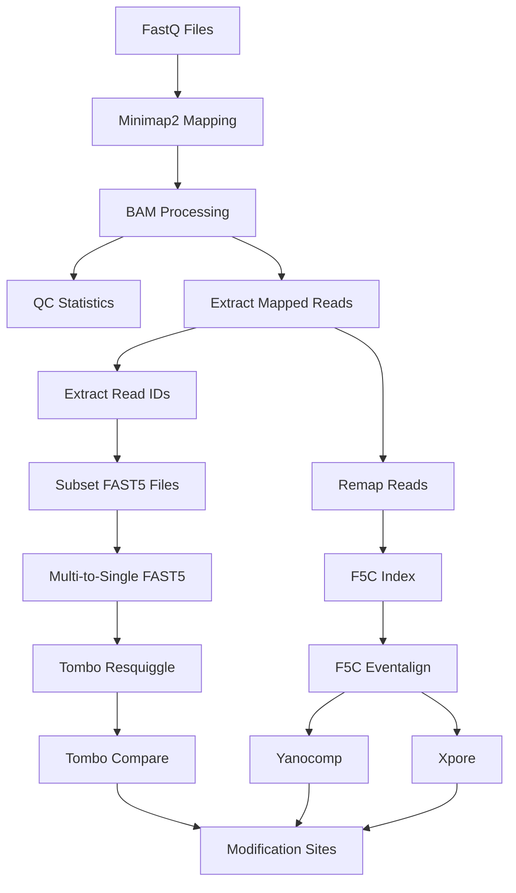

# nf-core/rnamodifications

[](https://www.nextflow.io/)
[](https://github.com/nf-core/tools/releases/tag/3.5.1)
[](https://docs.conda.io/en/latest/)
[](https://www.docker.com/)
[](https://sylabs.io/docs/)

## Introduction

**nf-core/rnamodifications** is a bioinformatics pipeline for detecting RNA modifications in Oxford Nanopore direct RNA sequencing data. The pipeline is specifically designed for analyzing 16S and 23S rRNA modifications in E. coli bacteria by comparing native and in vitro transcribed (IVT) RNA samples.

The pipeline performs the following steps:

1. **Input Validation**: Validates and processes input samplesheet
2. **Read Mapping**: Maps reads to 16S and 23S rRNA references using minimap2
3. **QC Statistics**: Generates mapping statistics, coverage plots, and read quality metrics
4. **Signal-Level Preparation**:
   - Extracts mapped reads and read IDs
   - Subsets relevant FAST5 files
   - Converts multi-read to single-read FAST5 format
   - Performs tombo resquiggling
   - Creates f5c index
5. **Signal Processing**: Runs f5c eventalign for signal-level analysis
6. **Modification Calling**: Detects RNA modifications using multiple tools:
   - **Tombo**: Statistical comparison of native vs IVT signals
   - **Yanocomp**: GMM-based modification detection
   - **Xpore**: Differential modification analysis

## Pipeline Summary



## Quick Start

1. Install [`Nextflow`](https://www.nextflow.io/docs/latest/getstarted.html#installation) (`>=23.04.0`)

2. Install any of [`Docker`](https://docs.docker.com/engine/installation/), [`Singularity`](https://www.sylabs.io/guides/3.0/user-guide/) (you can follow [this tutorial](https://singularity-tutorial.github.io/01-installation/)), [`Podman`](https://podman.io/), [`Shifter`](https://nersc.gitlab.io/development/shifter/how-to-use/) or [`Charliecloud`](https://hpc.github.io/charliecloud/) for full pipeline reproducibility

3. Prepare your samplesheet (see [Usage](#usage) section)

4. Run the pipeline:

```bash
nextflow run nf-core/rnamodifications \
    -profile singularity \
    --input samplesheet.csv \
    --ref_16s references/16S.fa \
    --ref_23s references/23S.fa \
    --outdir results
```

## Documentation

Detailed documentation for this pipeline is provided below.

### Input Specifications

#### Samplesheet Format

The input samplesheet must be a comma-separated file (CSV) with the following columns:

| Column       | Description                                                       |
|--------------|-------------------------------------------------------------------|
| sample       | Unique sample identifier                                          |
| fastq        | Path to FASTQ file                                                |
| type         | Sample type: `native` or `ivt`                                    |
| replicate    | Replicate identifier (e.g., rep1, rep2, rep3)                     |
| fast5_dir    | Path to directory containing FAST5 files for this sample          |

#### Example Samplesheet

```csv
sample,fastq,type,replicate,fast5_dir
native_rep1,/path/to/native_rep1.fastq,native,rep1,/path/to/native_fast5
native_rep2,/path/to/native_rep2.fastq,native,rep2,/path/to/native_fast5
native_rep3,/path/to/native_rep3.fastq,native,rep3,/path/to/native_fast5
ivt_rep1,/path/to/ivt_rep1.fastq,ivt,rep1,/path/to/ivt_fast5
ivt_rep2,/path/to/ivt_rep2.fastq,ivt,rep2,/path/to/ivt_fast5
ivt_rep3,/path/to/ivt_rep3.fastq,ivt,rep3,/path/to/ivt_fast5
```

### Reference Files

You need to provide FASTA files for both 16S and 23S rRNA references:

```bash
--ref_16s references/k12_16S.fa
--ref_23s references/k12_23S.fa
```

### Pipeline Parameters

#### Core Parameters

| Parameter    | Description                                      | Default     |
|--------------|--------------------------------------------------|-------------|
| `--input`    | Path to input samplesheet                        | Required    |
| `--outdir`   | Output directory for results                     | `./results` |
| `--ref_16s`  | Path to 16S rRNA reference FASTA                 | Required    |
| `--ref_23s`  | Path to 23S rRNA reference FASTA                 | Required    |

#### Mapping Parameters

| Parameter          | Description                   | Default                                  |
|--------------------|-------------------------------|------------------------------------------|
| `--minimap2_args`  | Additional minimap2 arguments | `-ax splice -uf -k14 --secondary=no`    |

#### Signal Processing Parameters

| Parameter                  | Description                       | Default                                                                |
|----------------------------|-----------------------------------|------------------------------------------------------------------------|
| `--tombo_resquiggle_args`  | Tombo resquiggle arguments        | `--rna --overwrite --num-most-common-errors 5`                        |
| `--tombo_compare_method`   | Tombo comparison method           | `de_novo`                                                              |
| `--f5c_eventalign_args`    | F5C eventalign arguments          | `--rna --scale-events --signal-index --print-read-names --samples`    |

#### Modification Calling Parameters

| Parameter                     | Description                         | Default |
|-------------------------------|-------------------------------------|---------|
| `--yanocomp_fdr_threshold`    | Yanocomp FDR threshold              | `1.0`   |
| `--yanocomp_min_ks`           | Yanocomp minimum KS statistic       | `0.0`   |
| `--xpore_pvalue_threshold`    | Xpore p-value threshold             | `0.05`  |
| `--xpore_diffmod_threshold`   | Xpore modification threshold        | `0.1`   |

#### Resource Parameters

| Parameter      | Description                        | Default  |
|----------------|------------------------------------|----------|
| `--max_cpus`   | Maximum CPUs per job               | `16`     |
| `--max_memory` | Maximum memory per job             | `128.GB` |
| `--max_time`   | Maximum time per job               | `240.h`  |

### Output Structure

```
results/
├── pipeline_info/           # Pipeline execution reports
├── mapping/                 # Mapped reads (SAM/BAM files)
│   ├── native/
│   │   ├── 16s/
│   │   └── 23s/
│   └── ivt/
│       ├── 16s/
│       └── 23s/
├── qc/                      # QC statistics and plots
│   ├── flagstat/
│   ├── depth/
│   ├── coverage/
│   └── nanoplot/
├── mapped_reads/            # Extracted mapped FASTQ files
├── read_ids/                # Read ID lists
├── fast5_subset/            # Subset FAST5 files
├── single_fast5/            # Single-read FAST5 files
├── tombo/                   # Tombo resquiggling output
├── eventalign/              # F5C eventalign output
├── yanocomp/                # Yanocomp intermediate files
├── xpore/                   # Xpore intermediate files
└── modifications/           # Final modification calls
    ├── tombo/               # Tombo results (BED files)
    ├── yanocomp/            # Yanocomp results (BED, JSON)
    └── xpore/               # Xpore results (CSV, tables)
```

## Usage Examples

### Basic Usage

```bash
nextflow run nf-core/rnamodifications \
    -profile singularity \
    --input samplesheet.csv \
    --ref_16s references/16S.fa \
    --ref_23s references/23S.fa \
    --outdir results
```

### Custom Resource Limits

```bash
nextflow run nf-core/rnamodifications \
    -profile singularity \
    --input samplesheet.csv \
    --ref_16s references/16S.fa \
    --ref_23s references/23S.fa \
    --max_cpus 32 \
    --max_memory 256.GB \
    --outdir results
```

### With Conda

```bash
nextflow run nf-core/rnamodifications \
    -profile conda \
    --input samplesheet.csv \
    --ref_16s references/16S.fa \
    --ref_23s references/23S.fa \
    --outdir results
```

### Resume a Run

```bash
nextflow run nf-core/rnamodifications \
    -profile singularity \
    --input samplesheet.csv \
    --ref_16s references/16S.fa \
    --ref_23s references/23S.fa \
    --outdir results \
    -resume
```

## Profiles

The pipeline provides several configuration profiles:

- `conda`: Use Conda for software management
- `mamba`: Use Mamba for software management (faster than Conda)
- `docker`: Use Docker containers
- `singularity`: Use Singularity containers
- `podman`: Use Podman containers
- `test`: Run with test data (small dataset)
- `test_full`: Run with full test data

## Software Requirements

The pipeline uses the following main software tools:

- **Minimap2** (v2.24): Read mapping
- **Samtools** (v1.17): BAM file processing
- **NanoPlot**: Read quality statistics
- **Tombo** (v1.5.1): Signal resquiggling and modification detection
- **F5C** (v1.1): Fast5 indexing and eventalign
- **Yanocomp**: Signal comparison and modification calling
- **Xpore**: Differential modification analysis

All software is automatically handled by the pipeline using containers or Conda environments.

## Credits

This pipeline was developed for RNA modification detection in bacterial rRNA using Oxford Nanopore direct RNA sequencing.

## Citations

If you use this pipeline, please cite:

- **Nextflow**: Di Tommaso, P., et al. (2017). Nextflow enables reproducible computational workflows. Nature Biotechnology, 35(4), 316-319.
- **Minimap2**: Li, H. (2018). Minimap2: pairwise alignment for nucleotide sequences. Bioinformatics, 34(18), 3094-3100.
- **Tombo**: Stoiber, M., et al. (2017). De novo identification of DNA modifications enabled by genome-guided nanopore signal processing. bioRxiv.
- **F5C**: Gamaarachchi, H., et al. (2020). Fast nanopore sequencing data analysis with SLOW5. Nature Biotechnology, 40, 1026-1029.
- **Yanocomp**: Liu, H., et al. (2021). Accurate detection of m6A RNA modifications in native RNA sequences. Nature Communications, 12(1), 2761.
- **Xpore**: Pratanwanich, P.N., et al. (2021). Identification of differential RNA modifications from nanopore direct RNA sequencing with xPore. Nature Biotechnology, 39, 1394-1402.

## Support

For questions and support:
- Open an issue on the GitHub repository
- Check the [Nextflow documentation](https://www.nextflow.io/docs/latest/)
- Visit the [nf-core website](https://nf-co.re/)
