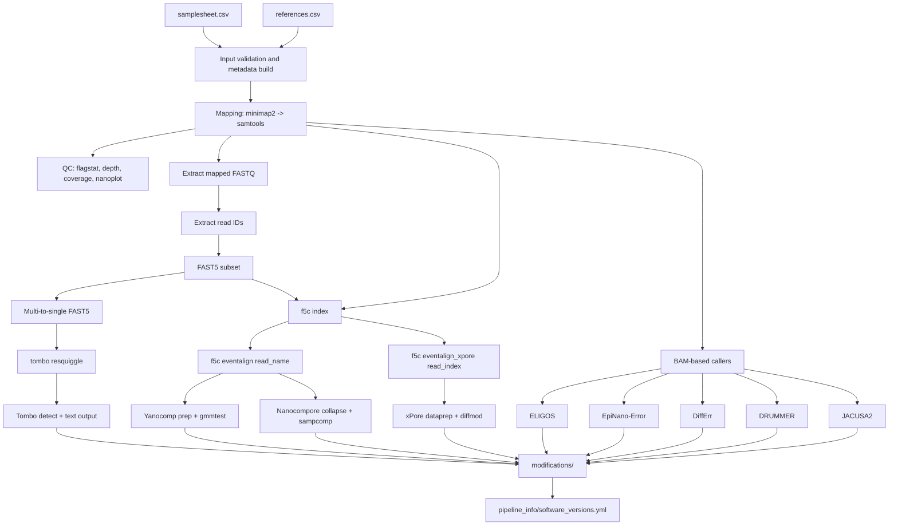

# bhargava-morampalli/rnamodbench

[](https://www.nextflow.io/)
[](https://docs.conda.io/en/latest/)
[](https://www.docker.com/)
[](https://sylabs.io/docs/)

## Introduction

`rnamodbench` is a Nextflow DSL2 pipeline for benchmarking RNA modification callers on Oxford Nanopore direct RNA sequencing data.

The pipeline uses pairwise native vs IVT comparisons per `target + replicate`, with dynamic target support driven by:
- input samplesheet `target` column
- `--references` CSV (`target,reference`)

Each sample is mapped once to its designated reference target (no dual mapping), then routed through signal preparation and multi-caller modification analysis.

## Pipeline Summary

1. Validate inputs, parse samplesheet, and parse target-to-reference mapping.
2. Map each sample to its designated target reference and generate sorted/indexed BAMs.
3. Generate QC metrics (flagstat, depth, coverage plots, NanoPlot).
4. Prepare signal-level data (read IDs, FAST5 subset, multi-to-single FAST5 conversion).
5. Run signal processing (f5c index/eventalign and tombo resquiggle).
6. Run modification callers and aggregate software versions/reports.

## Data Flow



Caller input routing:
- `tombo`: resquiggled single FAST5
- `yanocomp`, `nanocompore`: `eventalign` output with read names
- `xpore`: `eventalign_xpore` output with read index
- `eligos`, `epinano`, `differr`, `drummer`, `jacusa2`: paired native/IVT BAMs + target reference

## Quick Start

Canonical operator runbook for multi-coverage execution and downstream collation:
[`docs/operator_scripts_runbook.md`](docs/operator_scripts_runbook.md)

### 1) Clone and run locally

```bash
git clone <your-repo-url> rnamodbench
cd rnamodbench

nextflow run main.nf \
  --input /absolute/path/samplesheet.csv \
  --references /absolute/path/references.csv \
  --outdir /absolute/path/results \
  -profile singularity
```

### 2) Resume an interrupted run

```bash
nextflow run main.nf \
  --input /absolute/path/samplesheet.csv \
  --references /absolute/path/references.csv \
  --outdir /absolute/path/results \
  -profile singularity \
  -resume
```

### 3) Common profiles

- `singularity`
- `docker`
- `conda`
- `mamba`
- `apptainer`
- `podman`
- `shifter`
- `charliecloud`
- `test`
- `test_full`

## Public Release Checklist

- Revoke any previously exposed Seqera Tower token before changing repository visibility.
- Set Tower credentials only via environment variable (`TOWER_ACCESS_TOKEN`), not in tracked files.
- If git history is not rewritten, assume old commits may still contain revoked token text.

## Inputs

### Samplesheet (`--input`)

Required CSV columns:

Note: sample CSVs in this repository use placeholder paths and must be edited for your local filesystems and datasets.

| Column | Description |
| --- | --- |
| `sample` | Unique sample ID (no spaces) |
| `fastq` | FASTQ path (`.fq`, `.fastq`, optionally `.gz`) |
| `type` | `native` or `ivt` |
| `replicate` | Replicate identifier (`rep1`, `rep2`, ...) |
| `fast5_dir` | Directory containing FAST5 files |
| `target` | Target label (for example `16s`, `23s`, `5s`) |

Example:

```csv
sample,fastq,type,replicate,fast5_dir,target
native_16s_rep1,/data/native_16s_rep1.fastq.gz,native,rep1,/data/native_fast5,16s
ivt_16s_rep1,/data/ivt_16s_rep1.fastq.gz,ivt,rep1,/data/ivt_fast5,16s
native_23s_rep1,/data/native_23s_rep1.fastq.gz,native,rep1,/data/native_fast5,23s
ivt_23s_rep1,/data/ivt_23s_rep1.fastq.gz,ivt,rep1,/data/ivt_fast5,23s
```

### Reference map (`--references`)

Required CSV columns:

| Column | Description |
| --- | --- |
| `target` | Target label matching samplesheet `target` |
| `reference` | FASTA path for that target |

Example:

```csv
target,reference
16s,/refs/k12_16S.fa
23s,/refs/k12_23S.fa
```

## Required Pairing and FAST5 Assumptions

- Every `target + replicate` must have both `native` and `ivt` samples.
  - Missing pairs trigger a pipeline error during validation.
- Pooled FAST5 mode requires exactly one canonical FAST5 directory per sample type:
  - one for all `native` rows
  - one for all `ivt` rows
- FAST5 directories are canonicalized using real paths, so symlink/path variants collapse to the same directory.

## Modification Callers (Current)

- **Tombo**: de novo modification statistics from resquiggled FAST5; exported as `.tombo.stats` and CSV text output.
- **Yanocomp**: GMM-based comparison on eventalign-derived HDF5; exports BED and single-molecule JSON.
- **Nanocompore**: eventalign collapse + sample comparison; exports TSV/DB/log artifacts.
- **xPore**: dataprep + differential modification testing; exports `diffmod.table` per pair.
- **ELIGOS**: error signature based differential modification analysis from paired BAMs.
- **EpiNano-Error**: mismatch/sum_err based native-vs-IVT comparison outputs.
- **DiffErr**: differential error analysis on paired BAMs with permissive expression filters.
- **DRUMMER**: odds-ratio/p-value based differential signal from paired BAMs.
- **JACUSA2**: comparative variant-like site detection on paired BAMs.
- **NANORMS**: currently disabled in this workflow.

## Current Default Thresholds and All-sites Behavior

Defaults below are from `nextflow.config` and effective module args from `conf/modules.config`.

### Core caller defaults

| Parameter | Default | Notes |
| --- | --- | --- |
| `yanocomp_fdr_threshold` | `1.0` | Pass-through to `--fdr-threshold` |
| `yanocomp_min_ks` | `0.0` | Pass-through to `--min-ks` |
| `xpore_pvalue_threshold` | `0.05` | Defined in config; not currently injected into `xpore diffmod` command |
| `xpore_diffmod_threshold` | `0.1` | Defined in config; not currently injected into `xpore diffmod` command |
| `nanocompore_min_coverage` | `1` | Used in nanocompore args |
| `eligos_min_depth` | `1` | Broad coverage retention |
| `eligos_max_depth` | `10000` | Upper depth cap |
| `eligos_pval_thr` | `1.0` | No p-value filter |
| `eligos_oddR_thr` | `0` | No OR filter |
| `eligos_esb_thr` | `0` | No ESB filter |
| `epinano_zscore_threshold` | `0` | No z-score filter |
| `epinano_coverage_threshold` | `0` | Script uses `cov > threshold` |
| `epinano_error_threshold` | `0.1` | Error-rate difference threshold |
| `differr_fdr_threshold` | `1.0` | Keep all tested sites |
| `drummer_pval_threshold` | `1.0` | Keep all tested sites |
| `drummer_odds_ratio` | `0.0` | Runtime-safe guarded to positive epsilon before DRUMMER call |

### Effective module-level caller args

| Caller | Effective module args |
| --- | --- |
| Yanocomp | `--fdr-threshold ${params.yanocomp_fdr_threshold} --min-ks ${params.yanocomp_min_ks}` |
| Nanocompore | `--min_coverage ${params.nanocompore_min_coverage} --sequence_context 2 --pvalue_thr 1 --logit` |
| ELIGOS | `--min_depth ... --max_depth ... --pval ... --oddR ... --esb ...` |
| EpiNano-Error | `zscore`, `coverage`, `error_threshold` passed via module `ext.*` |
| DiffErr | `-f ${params.differr_fdr_threshold}` plus `--median-expr-threshold 0 --min-expr-threshold 0` |
| DRUMMER | `-p ${params.drummer_pval_threshold} -z <effective_odds>` plus `-f 0` |
| JACUSA2 | `-c 1 -m 0 -q 0` |
| xPore | Internal config writes `readcount_min: 1`, `readcount_max: 1000000`, `pooling: false`, `prefiltering: false` |

## Output Structure

Main output directories under `--outdir`:

```text
<outdir>/
  pipeline_info/
  mapping/<type>/<target>/
  qc/
    flagstat/<type>/<target>/
    depth/<type>/<target>/
    coverage/<type>/<target>/
    nanoplot/<type>/<target>/
  mapped_reads/<type>/<target>/
  read_ids/<type>/<target>/
  fast5_subset/<type>/<target>/
  single_fast5/<type>/<target>/
  eventalign/<type>/<target>/
  eventalign_xpore/<type>/<target>/
  yanocomp/prepare/<type>/<target>/
  nanocompore/eventalign_collapse/<type>/<target>/
  xpore/dataprep/<type>/<target>/

  modifications/
    tombo/
    yanocomp/<target>/
    nanocompore/
    xpore/
    eligos/<target>/
    epinano/<target>/
    differr/<target>/
    drummer/<target>/
    jacusa2/<target>/

  logs/
    tombo/
    yanocomp/<target>/
    nanocompore/
    xpore/
    eligos/<target>/
    epinano/<target>/
    differr/<target>/
    drummer/<target>/
```

Key `pipeline_info/` artifacts:
- `execution_report_*.html`
- `execution_timeline_*.html`
- `execution_trace_*.txt`
- `pipeline_dag_*.html`
- `software_versions.yml`

Optional downstream output (`--run_downstream true`):
- canonical downstream collation in `downstream_analysis/` uses DiffErr `g_fdr_neglog10`
- default dual-mode also writes DiffErr `g_stat` analysis under `downstream_analysis/differr_gstat/`

## Documentation, Support, and Credits

- Additional docs: [`docs/`](docs/README.md)
- Canonical operator scripts runbook: [`docs/operator_scripts_runbook.md`](docs/operator_scripts_runbook.md)
- Output details: [`docs/output.md`](docs/output.md)
- Usage details: [`docs/usage.md`](docs/usage.md)
- Tool citations: [`CITATIONS.md`](CITATIONS.md)
- License: [`LICENSE`](LICENSE)

For issues and feature requests, open an issue in this repository with:
- command used
- profile used
- relevant logs from `pipeline_info/` and `logs/`

## Deprecation Note

`--ref_16s` and `--ref_23s` are deprecated fallback parameters.

Use `--references` as the primary interface for target-to-reference mapping.
