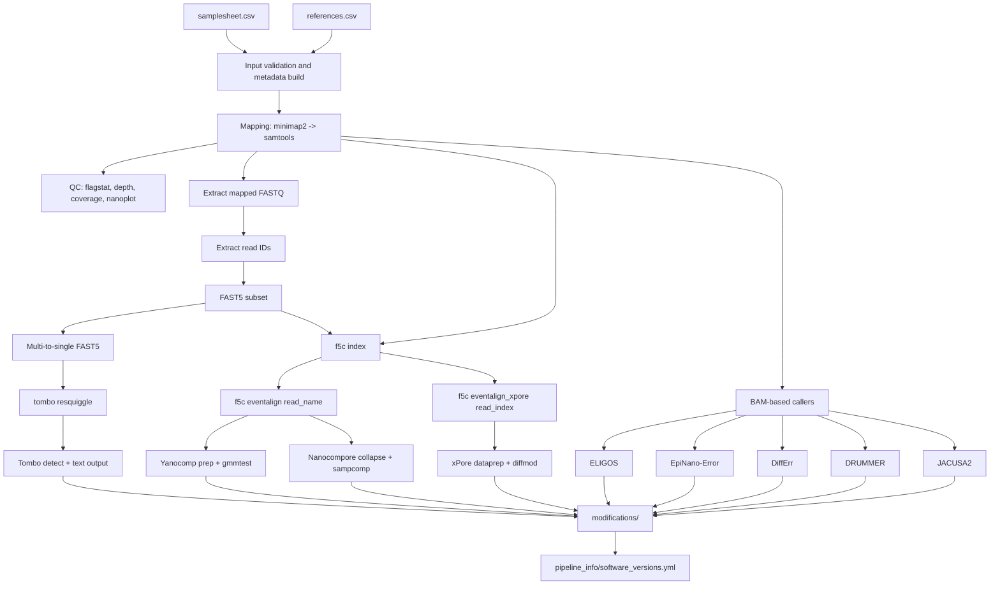

# bhargava-morampalli/rnamodbench

[](https://www.nextflow.io/)
[](https://docs.conda.io/en/latest/)
[](https://www.docker.com/)
[](https://sylabs.io/docs/)

## Introduction

`rnamodbench` is a Nextflow DSL2 pipeline for benchmarking RNA modification callers on Oxford Nanopore direct RNA sequencing data. It compares native RNA samples against in-vitro transcribed (IVT) controls using 9 modification detection tools.

## Pipeline Summary

1. Validate inputs, parse samplesheet, and parse target-to-reference mapping.
2. Map each sample to its designated target reference and generate sorted/indexed BAMs.
3. Generate QC metrics (flagstat, depth, coverage plots, NanoPlot).
4. Prepare signal-level data (read IDs, FAST5 subset, multi-to-single FAST5 conversion).
5. Run signal processing (f5c index/eventalign and tombo resquiggle).
6. Run modification callers and aggregate software versions/reports.

## Data Flow



Caller input routing:
- `tombo`: resquiggled single FAST5
- `yanocomp`, `nanocompore`: `eventalign` output with read names
- `xpore`: `eventalign_xpore` output with read index
- `eligos`, `epinano`, `differr`, `drummer`, `jacusa2`: paired native/IVT BAMs + target reference

## Quick Start

### 1) Clone and run locally

```bash
git clone <your-repo-url> rnamodbench
cd rnamodbench

nextflow run main.nf \
  --input /absolute/path/samplesheet.csv \
  --references /absolute/path/references.csv \
  --outdir /absolute/path/results \
  -profile singularity
```

### 2) Resume an interrupted run

```bash
nextflow run main.nf \
  --input /absolute/path/samplesheet.csv \
  --references /absolute/path/references.csv \
  --outdir /absolute/path/results \
  -profile singularity \
  -resume
```

### 3) Common profiles

| Profile | Description |
| --- | --- |
| `singularity` | Use Singularity containers |
| `docker` | Use Docker containers |
| `conda` / `mamba` | Use Conda/Mamba environments |
| `test` | Run with minimal test data |

## Inputs

### Samplesheet (`--input`)

Required CSV columns:

Note: sample CSVs in this repository use placeholder paths and must be edited for your local filesystems and datasets.

| Column | Description |
| --- | --- |
| `sample` | Unique sample ID (no spaces) |
| `fastq` | FASTQ path (`.fq`, `.fastq`, optionally `.gz`) |
| `type` | `native` or `ivt` |
| `replicate` | Replicate identifier (`rep1`, `rep2`, ...) |
| `fast5_dir` | Directory containing FAST5 files |
| `target` | Target label (for example `16s`, `23s`, `5s`) |

Example:

```csv
sample,fastq,type,replicate,fast5_dir,target
native_16s_rep1,/data/native_16s_rep1.fastq.gz,native,rep1,/data/native_fast5,16s
ivt_16s_rep1,/data/ivt_16s_rep1.fastq.gz,ivt,rep1,/data/ivt_fast5,16s
native_23s_rep1,/data/native_23s_rep1.fastq.gz,native,rep1,/data/native_fast5,23s
ivt_23s_rep1,/data/ivt_23s_rep1.fastq.gz,ivt,rep1,/data/ivt_fast5,23s
```

### Reference map (`--references`)

Required CSV columns:

| Column | Description |
| --- | --- |
| `target` | Target label matching samplesheet `target` |
| `reference` | FASTA path for that target |

Example:

```csv
target,reference
16s,/refs/k12_16S.fa
23s,/refs/k12_23S.fa
```

## Modification Callers

| Tool | Approach | Input |
| --- | --- | --- |
| Tombo | Signal-level de novo detection | Resquiggled FAST5 |
| Yanocomp | GMM-based current comparison | Eventalign HDF5 |
| Nanocompore | Sample comparison | Eventalign collapsed |
| xPore | Bayesian differential modification | Eventalign (read index) |
| ELIGOS | Error signature analysis | Paired BAMs |
| EpiNano-Error | Mismatch-based comparison | Paired BAMs |
| DiffErr | Differential error rate | Paired BAMs |
| DRUMMER | Odds-ratio based detection | Paired BAMs |
| JACUSA2 | Variant-like site detection | Paired BAMs |

> Each `target + replicate` requires both `native` and `ivt` samples. See [docs/usage.md](docs/usage.md) for parameter details.

## Output Structure

Key output directories under `--outdir`:

| Directory | Contents |
| --- | --- |
| `mapping/` | Sorted BAMs and indices |
| `qc/` | Flagstat, depth, coverage, NanoPlot |
| `modifications/` | Per-tool modification calls |
| `logs/` | Per-tool log files |
| `pipeline_info/` | Execution reports, timeline, DAG, software versions |
| `downstream_analysis/` | Benchmark metrics, visualizations (if `--run_downstream true`) |

See [docs/output.md](docs/output.md) for full details.

## Documentation

| Document | Description |
| --- | --- |
| [docs/usage.md](docs/usage.md) | Parameters and configuration |
| [docs/output.md](docs/output.md) | Output file descriptions |
| [docs/downstream_analysis.md](docs/downstream_analysis.md) | Downstream analysis usage |
| [CITATIONS.md](CITATIONS.md) | Tool citations |

## Credits

This pipeline was developed by [Bhargava Morampalli](https://github.com/bhargava-morampalli).

## Support

For issues and feature requests, open an issue in this repository.
